# Dynamo 남은 작업 실행 계획서

작성일: 2026-07-31

대상 브랜치: `refactor`

기준 커밋: `073d276` (`fix(perf): await isolated descendant drain`)

상위 계획: [DYNAMO_IMPROVEMENT_WORK_PLAN.md](DYNAMO_IMPROVEMENT_WORK_PLAN.md)

## 1. 목적과 문서 효력

이 문서는 상위 계획의 36개 작업 중 아직 끝나지 않은 작업을 현재 저장소 상태에 맞춰 다시 배열한 실행용 문서다. 새로운 요구사항을 추가하는 문서가 아니라 다음 작업자가 바로 구현·검증·인계할 수 있도록 현재 증거, 차단점, 순서, 완료 조건을 고정한다.

상위 계획의 보안·성능·UI 계약은 계속 유효하다. 다만 진행 상태와 다음 실행 순서는 이 문서의 2026-07-31 스냅샷을 우선한다. 상태를 바꿀 때는 커밋, 실행 명령, 결과 파일, 실패 코드 중 하나 이상의 재현 가능한 증거를 함께 남긴다.

이 문서는 PowerShell 도구 작성 자체를 제품 개선으로 계산하지 않는다. 도구는 실제 제품 경로를 안전하게 측정하거나 검증할 때만 완료 증거가 된다.

## 2. 현재 상태

### 2.1 전체 작업 상태

| 구분 | 작업 | 상태 | 현재 증거 |
| --- | --- | --- | --- |
| 완료 | W0-00, W0-02, W1-01 | 3/36 완료 | `609d3c9`, `99dff55`·`36fef09`, `0f6be8d` |
| 부분 완료 | W0-01 | 진행 중 | 부하 kernel, Mongo 격리, Windows Job, dashboard runner, browser static contract 구현 |
| 미착수 | 나머지 32개 | 미착수 | 상위 계획의 작업 추적표 기준 |
| 현재 중요 경로 | W0-01A runner/Public → R1B UX baseline → W1-03 → W0-01B 실제 브라우저 → W1-04/05 | 차단 해소 필요 | live runner의 `child-descendants-survived` |

완료율은 여전히 3/36이다. W0-01에 여러 지원 커밋이 들어갔지만 동일 revision·fixture의 retained baseline 2회와 실제 브라우저 실행이 없으므로 완료 작업으로 올리지 않는다.

### 2.2 이미 확보한 기반

| 영역 | 확보된 결과 | 검증 수준 |
| --- | --- | --- |
| 보안 바닥 | moderation hierarchy, owner-only 환경 파일 계약 | 제품 코드와 회귀 테스트 완료 |
| 폰트 | Fira 자가 호스팅, content-addressed route, ETag/304 | dashboard 테스트와 외부 폰트 요청 0 확인 |
| Rust 품질 | locked check/test, strict Clippy | CI 필수 게이트 |
| Mongo 격리 | MongoDB 7 격리 runner와 cleanup contract | CI와 계약 테스트 |
| 부하 측정 | deterministic load/budget kernel | 단위 계약 완료 |
| 프로세스 격리 | Windows Job primitive | 계약 테스트 완료 |
| dashboard 격리 | ACL 보호와 descendant drain 논리 | 계약 테스트 완료 |
| 브라우저 안전 계약 | same-origin, no-proxy, no-service-worker, no-write, 고정 Playwright/Chromium | Node static contract 59/59 |

관련 커밋은 `9a44a50`부터 `073d276`까지다. 2026-07-31 스냅샷에서 작업 트리는 깨끗하고 `cargo`, `rustc`, `link`, `mspdbsrv`, dashboard harness 잔류 프로세스는 없었다. 이 사실은 이전 실패가 성공으로 바뀌었다는 뜻이 아니라 현재 정리가 끝났다는 뜻만 가진다.

### 2.3 아직 증명하지 못한 것

- 실제 `Public+Load` 실행은 `attempt-acl-failed`를 수정한 뒤에도 `child-descendants-survived`에서 끝났다.
- `output/perf`에 유지할 수 있는 live baseline 결과가 없다.
- runner는 인자를 정의하고 있지만 현재 실제 허용 조합은 `Public+Load`뿐이다.
- `ReadOnly+Playwright`, `GuildDetail+Load`, `Public+Npm`은 결과 inventory에 예정 조합으로만 존재한다.
- Playwright 계약 테스트는 통과했지만 실제 Chromium 12-cell UI matrix는 실행하지 않았다.
- dashboard GET이 Mongo write 0이라는 제품 계약은 아직 성립하지 않는다.
- 실제 사용자가 UI를 편리하게 사용할 수 있다는 결론을 낼 baseline/final 50 trial은 수행하지 않았다.
- 보안 전체 deep scan은 사용량 제한으로 완료하지 않았다. 이후 보안 작업은 표준·범위 제한 검증과 36개 closure matrix로 추적한다.

## 3. 즉시 실행 순서

```mermaid
flowchart LR
    A["R0 프로세스 잔류 원인 규명"] --> B["R1 Public+Load 2회 기준선"]
    B --> C["R1B 사람 대상 UX baseline 50 trial"]
    C --> D["R2 W1-03 write-free read"]
    D --> E["R3 ReadOnly+Playwright 연결"]
    E --> F["R4 W1-04 자산·read-only smoke"]
    F --> G["R5 W1-05 접근성·반응형 기반"]
    G --> H["R6 W2~W6 제품 개선"]
    H --> I["R7 최종 자동·사람 UI 검증과 canary"]
```



W0-01의 live runner, Public baseline, 사람 대상 UX baseline을 먼저 끝내고 W1-03을 첫 제품 checkpoint로 처리한다. W1-03 전에는 GuildDetail 부하 결과의 GET write 수를 성능 회귀로 판정하지 않는다. W1-03 후에야 read-only 브라우저 경로와 UI 상태 표현을 신뢰할 수 있다.

상위 계획의 순환 의존성을 실행 가능하게 만들기 위해 W0-01을 두 checkpoint로 공식 분할한다.

- W0-01A: R0, R1, R1B의 runner·Public·사람 대상 baseline. W1-03의 필수 선행조건이다.
- W0-01B: R3의 실제 `ReadOnly+Playwright`와 W1-03 이후 mutation-zero browser closure.

W0-01 전체 상태는 W0-01B까지 끝날 때까지 “진행 중”으로 유지한다. W1-03은 W0-01A GREEN 뒤 시작하는 명시적 예외 순서이며, 이 분할을 상위 계획 추적표에도 기록한다.

권장 소유권은 다음과 같다. 한 사람이 여러 역할을 맡을 수 있지만 같은 checkpoint의 구현자와 승인 리뷰어는 가능하면 분리한다.

| 작업 | 주 소유 역할 | 필수 리뷰 |
| --- | --- | --- |
| R0~R1 | Windows/Rust 성능·빌드 | 보안 리뷰, dashboard maintainer |
| R2 | repository/persistence backend | dashboard maintainer, 테스트 리뷰 |
| R3~R5 | dashboard UI·테스트 자동화 | 접근성 리뷰, backend maintainer |
| W2~W4 | 보안·runtime·persistence | 해당 모듈 maintainer |
| W5~W6 | dashboard UX·운영 | 접근성, 보안, 배포 리뷰 |

## 4. R0 — live runner 차단 해소

대응 작업: W0-01 잔여

예상: 1~2 엔지니어일

### 4.1 확인된 실패 이력

1. 첫 live 실행은 `attempt-acl-failed`로 중단됐다.
2. 기존 owner를 보존하고 보호 ACL을 적용하도록 수정한 뒤 ACL 계약 446개 assertion이 통과했다.
3. 다음 실행은 `child-descendants-survived`로 중단됐다.
4. direct child 종료 뒤 최대 5초 동안 active process 수와 PID 목록이 모두 비는 것을 기다리도록 수정했다.
5. short-lived descendant와 long-lived descendant 계약 497개 assertion은 통과했지만 실제 full build 실행은 다시 `child-descendants-survived`였다.

### 4.2 구현 절차

1. 새 Job 기반 full-build 진단을 한 번만 실행하고 실패 시점의 PID, process name, executable path, parent PID, Job active count를 비밀값 없이 보존한다.
2. `C:\Users\MARU\.cargo\bin\cargo.exe` rustup proxy와 실제 stable toolchain의 `cargo.exe`를 구분한다.
3. 잔류 프로세스가 `cargo`, `rustc`, `link`, `mspdbsrv` 중 무엇인지 확인한다.
4. 원인에 따라 다음 중 가장 좁은 수정을 택한다.

   - rustup proxy가 소유권을 흐리면 고정된 active toolchain의 cargo를 직접 실행한다.
   - build helper가 정상 종료 중이면 측정 가능한 bounded drain 조건을 정의한다.
   - parent exit 뒤 orphan helper가 남으면 허용된 build helper만 명시적으로 종료하고 PID·경로·Job 소속을 다시 검증한다.

5. 단순히 대기 시간을 늘리는 수정은 금지한다. 종료 대상과 정상 최대 시간이 증거로 확인된 경우에만 timeout을 조정한다.

진단 증거는 보호된 repo-local temp leaf에 고정 schema의 sanitized JSON으로 기록한다. raw command line, 환경 변수, URI, cookie, nonce는 기록하지 않는다. 원인 규명과 회귀 테스트 작성 뒤 tracked 문서에는 digest와 결론만 옮기고 temp 진단 파일은 삭제한다. reparse point 또는 소유권 불일치가 감지되면 자동 삭제하지 않고 fail-closed 상태로 보존해 수동 검토한다.

### 4.3 완료 조건

- Windows Job 계약과 isolated dashboard 계약이 모두 GREEN이다.
- 실제 full build가 성공 또는 실패한 뒤 Job active process 0, PID 목록 0이다.
- repo 밖 프로세스를 종료하지 않는다.
- 진단 stdout/stderr에 Mongo URI, 세션 키, nonce, 쿠키가 없다.
- 성공 attempt는 marker, result, budget, summary의 정확히 4개 allowlisted leaf만 보존한다.
- 일반 실패 attempt는 runner가 소유한 디렉터리를 제거한다.
- reparse point, 소유권 불일치 등 안전하지 않은 cleanup은 삭제하지 않고 fail-closed로 보존한다.
- 수정 전 실패를 재현하는 RED와 수정 후 GREEN이 같은 계약에 남는다.

### 4.4 검증 명령

```powershell
pwsh -NoProfile -File tests/perf/isolated-process-job-contract.ps1
pwsh -NoProfile -File tests/perf/isolated-dashboard-contract.ps1
npm run perf:test
```

중단 조건:

- unrelated PID나 repo 밖 실행 파일을 종료해야만 성공하는 경우
- production/shared Mongo URI가 감지된 경우
- ACL owner를 바꾸거나 현재 사용자와 SYSTEM 외 ACE가 생기는 경우
- 비밀값이 결과 파일이나 console에 노출되는 경우

## 5. R1 — 실제 Public 성능 기준선 발행

대응 작업: W0-01 잔여

예상: R0 완료 후 0.5~1 엔지니어일

### 5.1 실행

같은 revision, fixture, build profile, 요청 수로 레이블만 달리해 두 번 실행한다.

```powershell
pwsh -NoProfile -File scripts/perf/with-isolated-dashboard.ps1 -FixtureMode Public -Workload Load -OutputRoot output/perf -Label public-baseline-a -Path / -Requests 50 -Concurrency 1
pwsh -NoProfile -File scripts/perf/with-isolated-dashboard.ps1 -FixtureMode Public -Workload Load -OutputRoot output/perf -Label public-baseline-b -Path / -Requests 50 -Concurrency 1
```

현재 이 명령은 GREEN으로 간주하지 않는다. R0 수정 전에는 재실행 횟수를 늘리지 않는다.

### 5.2 결과 계약

- 두 실행 모두 동일 schema의 result, budget, summary JSON을 남긴다.
- metadata에 revision, OS, CPU, power profile, Rust/Node version, build profile, fixture hash가 있다. browser는 실행하지 않았음을 명시하고 고정 browser lock metadata만 기록한다.
- route p50/p95, 전송 bytes, RSS, repository read/mutation counter, outbound 수가 기록된다.
- 동일 revision·fixture에서 예산 판정이 서로 모순되지 않는다.
- 성공 후에도 Job active process 0, PID 목록 0, 임시 DB·포트 cleanup을 확인한다.
- 각 성공 attempt에는 정확히 4개 allowlisted leaf만 남고 다른 파일·디렉터리는 없다.
- 결과 파일만 retained inventory에 남고 URI, nonce, cookie, raw secret은 남지 않는다.

완료 후 상위 계획의 W0-01을 바로 완료로 바꾸지 않는다. R1B의 유효한 50-trial evidence와 W0-01B의 실제 read-only browser baseline까지 확보한 뒤 완료 여부를 판정한다.

## 5A. R1B — 사람 대상 UX baseline 발행

대응 작업: W0-01 잔여

예상: 2~3 엔지니어일, 참가자 모집 대기시간 별도

W1-03을 포함한 dashboard UI·상태 표현 변경 전에 현재 UI의 baseline을 먼저 고정한다. 이 단계가 끝나기 전에는 W1-03, W1-04, W1-05, W5의 UI 변경을 시작하지 않는다.

### 5A.1 실행 계약

- 참가자 10명은 occasional 관리자 5명과 regular 관리자 5명으로 구성하고 구현 참여자는 제외한다.
- 참가자당 상위 계획 W5-06의 고정 과업 5개를 한 번씩 수행해 정확히 50 trial을 만든다.
- 과업 순서는 balanced Latin-square로 배치한다.
- 각 trial 전 deterministic fake fixture를 같은 hash로 초기화한다.
- browser, viewport, font-ready 조건, 평가자 script, 도움 규칙과 도움 문구 한 문장을 고정한다.
- shared, staging, production guild/database와 live Discord/Toss를 사용하지 않는다.

### 5A.2 결과와 완료 조건

- trial별 `completed`, `unassisted`, `duration_ms`, `help_count`, `critical_error`, `SEQ 1~7`을 기록한다.
- participant identifier는 연구용 pseudonym으로 분리하고 제품 로그·repository에는 넣지 않는다.
- immutable 외부 evidence 위치에 schema, fixture hash, cohort 구성, evaluator script hash, 50개 trial을 보존한다.
- tracked 문서에는 evidence URI, content digest, schema version, 실행일만 기록한다.
- 누락 trial, fixture drift, 도움 문구 변경, 외부 요청이 하나라도 있으면 baseline 전체를 무효화한다.

참가자를 확보하지 못했거나 50개 유효 trial을 만들지 못하면 UI 변경을 중단한다. 이 checkpoint를 완료하면 W0-01A를 GREEN으로 판정하고 분할 상태와 evidence를 상위 계획에 기록한다. W0-01 전체 완료 처리는 R3의 W0-01B까지 보류한다.

## 6. R2 — W1-03 write-free guild settings read

예상: 1~2 엔지니어일

이 단계가 다음 실제 제품 변경이다. dashboard 조회가 설정 문서를 생성하는 현재 동작을 제거하고, “없음”, “있음”, “읽기 실패”를 서버와 UI에서 구분한다.

### 6.1 변경 대상

- `crates/repositories/src/lib.rs`
- `crates/persistence-api/src/lib.rs`
- `crates/persistence-mongo/src/lib.rs`
- `crates/settings/src/lib.rs`
- `crates/modules/ticket/src/settings.rs`
- `crates/dashboard/src/lib.rs`
- `crates/dashboard/src/perf_harness.rs`
- 관련 repository, persistence, dashboard 테스트

### 6.2 인터페이스와 동작

- `GuildSettingsRepository::get(guild_id) -> Result<Option<GuildSettings>, Error>`를 도입한다.
- Mongo 구현은 `find_one`만 수행하며 GET에서 upsert하지 않는다.
- `GuildSettings::empty_for_guild(guild_id)`는 표현용 기본값을 만든다.
- persistence 경계는 strict `load_guild_settings(guild_id) -> Result<Option<GuildSettings>, Error>`와 presentation fallback `guild_settings_or_default`를 분리한다.
- repository 자체가 구성되지 않은 경우 strict load는 unavailable 오류로 처리하고 absent로 위장하지 않는다.
- PATCH와 ticket mutation만 `get()?.unwrap_or_else(|| GuildSettings::empty_for_guild(guild_id))` 후 upsert할 수 있다.

### 6.3 dashboard 상태 계약

| 상태 | HTTP/UI 동작 | 쓰기 |
| --- | --- | --- |
| existing | 200, 저장된 설정을 표시 | GET 0 |
| absent | 200, 기본 표현과 “아직 저장되지 않음” 상태 배너 | GET 0 |
| unavailable | 503, 복구 안내와 재시도 | 0 |

기존 정상 body 호환성을 유지하되 세 상태 모두 `X-Dynamo-Guild-Settings-State`와 `Cache-Control: no-store`를 반환한다. unavailable HTML/API에는 form, toggle, sync control을 렌더링하지 않고 내부 오류·Mongo URI·컬렉션명을 노출하지 않는다.

### 6.4 테스트와 완료 조건

- fake repository가 read/write 횟수를 각각 세고 GET write 0을 증명한다.
- isolated Mongo에서 GET 전후 문서 수가 같고 첫 mutation 뒤 정확히 1개가 된다.
- absent, existing, unavailable HTML/API의 status, header, `no-store`, 노출 control을 검증한다.
- `GuildDetail+Load`와 `ReadOnly`의 mutation counter가 0이다.
- unavailable 테스트에서 내부 오류 문자열 누출 0이다.
- 아래 Rust gate가 모두 통과한다.

```powershell
cargo test -p dynamo-dashboard --all-features --locked
cargo test --workspace --all-features --locked
cargo clippy --workspace --all-targets --all-features --locked -- -D warnings
```

rollback은 새 read 인터페이스와 호출부를 한 checkpoint로 되돌린다. GET upsert를 임시 복구해 문제를 숨기지 않는다.

## 7. R3 — 실제 브라우저 기준선 연결

대응 작업: W0-01 잔여, W1-03 후속

예상: 1~2 엔지니어일

### 7.1 구현

- runner에서 `ReadOnly+Playwright`를 실제 허용 조합으로 연결한다.
- W1-03 GREEN 뒤 `GuildDetail+Load`를 연결한다.
- repository-local Playwright 1.58.2와 고정 Chromium revision 1208, version 145.0.7632.6만 사용한다.
- local fake auth/transport를 사용하고 unmocked outbound를 abort한다.
- Pass proof와 의도적 Red proof를 각각 보존한다.

### 7.2 자동 UI matrix

현재 suite manifest의 다음 3개 고정 test ID를 375, 768, 1024, 1440px에서 실행해 정확히 12개 cell을 만든다.

1. `public-responsive-reduced-motion`
2. `guild-readonly-dialog`
3. `same-origin-font-proof`

absent, existing, unavailable은 W1-03의 focused HTML/API 상태 matrix에서 별도로 검증한다. 이를 browser suite에 추가하거나 기존 test ID를 바꿀 때는 suite schema/version, expected cell 수, static contract를 같은 checkpoint에서 함께 갱신한다.

각 cell은 다음을 기록한다.

- horizontal overflow 0
- 첫 텍스트 표시, font-ready, CLS, computed font face
- DOM node 수와 route bytes
- 키보드 tab 순서, visible focus, skip link
- 오류 `role=alert` 또는 `aria-live`
- write method 0, repository mutation 0, unmocked outbound 0
- console error, page error, failed request

### 7.3 완료 조건

- 12개 cell 모두 Pass다.
- 의도적 write 또는 unmocked outbound를 넣은 Red proof가 정확한 이유로 실패한다.
- selected test 1개 이상, skipped 0이다.
- Playwright 결과에는 8개 안전 counter와 result-only inventory가 있다.
- 실행 metadata에는 실제 Playwright와 Chromium version/revision이 있다.
- Chromium, dashboard, cargo/rustc/link helper, 포트, temp dir가 모두 정리된다.
- `npm run perf:test` 59/59 계약을 유지한다.

자동 matrix 통과는 “사용하기 편리하다”의 충분조건이 아니다. 이는 기능·안전·반응형 결함을 찾는 첫 관문이다.

## 8. R4 — W1-04 자산 추출과 read-only smoke

예상: 1~2 엔지니어일

- inline CSS와 JavaScript를 content-hashed same-origin asset으로 이동한다.
- Brotli/gzip, 정확한 content type, immutable cache, ETag를 적용한다.
- 기존 smoke의 ETF toggle/save와 SOXL/TQQQ write oracle을 제거한다.
- smoke 중 PATCH/POST/PUT/DELETE를 발견하면 즉시 실패한다.
- fresh worktree에서 `npm ci`와 repository-local Playwright만 사용한다.
- root decoded HTML 10 KiB 이하, mutation 0, skipped 0, 외부 script/font 요청 0을 만족한다.
- W0-00 font body/header hash가 바뀌지 않아야 한다.

## 9. R5 — W1-05 접근성·반응형 기반

예상: 2~3 엔지니어일

UI 자동 추천의 가로 스크롤·landing-page 패턴은 관리 대시보드에 부적합하므로 채택하지 않는다. 다음 운영 UI 기준만 적용한다.

- 모든 기능을 keyboard-only로 실행할 수 있고 tab 순서가 시각 순서와 같다.
- focus ring을 제거하지 않으며 navigation이 긴 화면에는 skip-to-content를 제공한다.
- 오류는 관련 입력 근처에 표시하고 `aria-invalid`, `aria-describedby`, `role=alert` 또는 `aria-live`로 연결한다.
- 오류 메시지는 원인만 말하지 않고 retry, 되돌리기, 지원 참조 등 다음 행동을 제공한다.
- dialog focus trap, Escape, focus return을 검증한다.
- `prefers-reduced-motion`에서 불필요한 전환을 제거한다.
- 375, 768, 1024, 1440px에서 page horizontal overflow는 0이다. 넓은 표만 명시적 local scroll 또는 card layout을 허용한다.
- normal, hover, focus, disabled control과 muted/accent text의 계산된 contrast를 검증한다.
- touch target, label, accessible name, status announcement를 자동 검사한다.

완료 증거는 스크린샷만으로 대체할 수 없다. DOM assertion, keyboard trace, contrast 결과, overflow 측정, Windows Narrator 수동 기록을 함께 남긴다.

## 10. 후속 제품 작업

### 10.1 다음 P1 묶음

| 순서 | 작업 | 핵심 산출물 | 선행조건 |
| --- | --- | --- | --- |
| 1 | W1-02 finite HTTP/Discord directory | deadline, bounded retry, directory/cache 계약 | W0-01 |
| 2 | W1-04 hashed CSS/JS | 작고 캐시 가능한 자산과 read-only smoke | R3 |
| 3 | W1-05 accessibility/responsive | 상태 독립적 UI 접근성 기반 | W1-04 |
| 4 | W2-03A guild-scoped effect 계약 | Discord effect의 guild 소유권 타입 | W1-01 |
| 5 | W3-01 Mongo index 계약 | 애플리케이션 소유 index와 duplicate preflight | W0-01 |

W1-02는 네트워크 지연을 무한 대기로 바꾸지 않으며 timeout, retry, cache cardinality를 W0-01 counter로 관찰한다.

### 10.2 Phase 2~6

| 단계 | 남은 작업 | 종료 조건 |
| --- | --- | --- |
| Phase 2 권한/effect | W2-01, W2-02, W2-03A/B | 요청 시점 권한 재검증, guild-scoped effect, component/modal live gate |
| Phase 3 persistence | W3-01~04 | index 소유권, 원자 갱신, idempotent dashboard mutation |
| Phase 4 runtime | W4-01~06 | bounded work, cache lifecycle, retry/single-flight, effect 소유권 |
| Phase 5 dashboard UX | W5-01~06 | 권위 있는 상태, fail-closed 오류, save reconciliation, dirty/undo, 긴 목록, UI gate |
| Phase 6 운영 | W6-01~05 | dependency, 로그 보존, deterministic artifact, canary/rollback, 36개 finding closure |

세부 인터페이스, 공수, RED/GREEN, rollback 규칙은 상위 계획의 각 작업 절을 따른다. 한 작업의 공통 경계를 다음 작업에서 다시 만들지 않는다.

## 11. UI가 정말 편리한지 검증하는 방법

### 11.1 자동 검증과 사람 검증의 구분

| 질문 | 자동화로 판정 | 사람 검증 필요 |
| --- | --- | --- |
| 화면이 깨지지 않는가 | viewport, overflow, CLS, DOM, console | 보조 확인 |
| 키보드·스크린리더가 접근 가능한가 | focus, role, name, tab order | Windows Narrator 실제 사용 |
| 잘못된 쓰기를 막는가 | method/Mongo counter, Red proof | 결과 이해 여부 |
| 오류에서 복구할 수 있는가 | Retry/Undo/status DOM과 state | 다음 행동을 스스로 찾는지 |
| 작업이 편리한가 | 시간·오류 수집 도구 | 성공률, 도움 요청, SEQ, 관찰 |

자동 테스트만 통과한 상태에서 “편리하게 구현됐다”고 결론 내리지 않는다.

### 11.2 baseline과 final protocol

- baseline 10명과 final 10명은 서로 다른 참가자다.
- 각 cohort는 occasional 관리자 5명과 regular 관리자 5명이며 구현 참여자는 제외한다.
- 참가자당 고정 과업 5개를 수행해 phase당 정확히 50 trial을 만든다.
- 과업 순서는 balanced Latin-square로 배치한다.
- browser, viewport, font-ready, 평가자 script, fixture hash, 도움 규칙을 두 phase에서 고정한다.
- trial별 `completed`, `unassisted`, `duration_ms`, `help_count`, `critical_error`, `SEQ 1~7`을 기록한다.
- shared, staging, production guild/database와 live Discord/Toss를 사용하지 않는다.

최종 다섯 과업은 상위 계획 W5-06의 검색·상태 설명·dirty close·응답 유실 reconciliation·Undo 시나리오를 그대로 사용한다.

### 11.3 최종 합격 기준

- critical error 0
- 50회 중 46회 이상 도움 없이 완료
- 각 과업 median SEQ 5/7 이상
- 어떤 과업·경험 집단도 baseline보다 느려지지 않음
- 최소 3개 과업의 median 시간이 10% 이상 개선
- keyboard-only와 Windows Narrator로 pending/error/success/outcome-unknown, confirmation, Undo, lazy modal Retry, dirty close, 409 확인
- 별도 375px human sanity pass와 전체 자동 route/state matrix의 overflow 0

참가자 모집 대기는 개발 공수와 별도로 관리한다. baseline cohort를 확보하지 못하면 W5-06 final 비교를 완료할 수 없다.

## 12. CI, 릴리스, 문서 작업

### 12.1 CI

- Windows W0 job에 Job contract, dashboard contract, browser contract를 넣는다.
- R0 해소 후 같은 HEAD의 Public baseline 2회 실행을 별도 안정성 gate로 둔다.
- R3 이후 실제 `ReadOnly+Playwright` matrix를 추가한다.
- MongoDB 7 격리, locked workspace test, strict Clippy를 계속 필수로 유지한다.
- flaky 재실행으로 GREEN을 만들지 않고 첫 실패 artifact를 보존한다.

### 12.2 릴리스

- perf harness binary와 fixture가 production artifact에 포함되지 않는 allowlist 검사를 추가한다.
- W6-03에서 exact revision, checksum, dependency inventory가 있는 Pi artifact를 만든다.
- W4 완료 뒤 exact binary로 7일 관찰을 먼저 수행한다.
- 그 관찰을 선행조건으로 W6-04에서 30분 canary, rollback rehearsal, 24시간 soak를 수행한다.
- live 검증은 staging 전용 guild/database에서만 하고 production 전이는 별도 승인 뒤 수행한다.

### 12.3 문서

- 각 checkpoint 뒤 이 문서의 상태와 evidence 경로를 갱신한다.
- W0-01, W1-03 완료 시 상위 계획의 2장 실행 현황과 13장 추적표를 동기화한다.
- W6-05는 정확히 36개 unique finding slug를 source path, test, control, rollout, evidence와 연결한다.
- 오래된 퍼센트는 자동 계산 근거 없이 갱신하지 않는다.

## 13. 권장 checkpoint와 커밋 순서

1. `fix(perf): bind and drain the actual build process tree`
2. `test(perf): retain repeatable public dashboard baselines`
3. `docs(ux): record pre-change usability baseline evidence`
4. `fix(dashboard): make guild settings reads side-effect free`
5. `test(dashboard): run the isolated readonly browser matrix`
6. `refactor(dashboard): serve hashed css and javascript assets`
7. `fix(dashboard): establish accessible responsive foundations`

각 checkpoint는 하나의 실패 원인 또는 제품 계약만 소유한다. `output/`의 generated baseline JSON은 Git에 커밋하지 않고 CI 또는 승인된 외부 immutable artifact 저장소에 보존한다. tracked 문서에는 schema version, content digest, evidence URI만 기록하며 temp, DB, cookie, URI credential, nonce를 포함하지 않는다.

## 14. 공통 작업 완료 정의

개별 작업은 다음 조건을 모두 만족해야 완료다.

- 요구한 제품 동작 또는 검증 경로가 실제로 변경됐다.
- focused RED가 수정 전 실패하고 GREEN이 수정 후 통과한다.
- 관련 package 테스트와 workspace strict gate가 통과한다.
- 보안·성능 counter가 이전 기준보다 나빠지지 않는다.
- 실패·panic·timeout에서도 프로세스, 포트, DB, temp가 정리된다.
- 결과에 비밀값과 사용자 식별 정보가 없다.
- rollback 단위와 중단 조건이 기록됐다.
- 커밋, 명령, 결과 경로를 이 문서 또는 상위 계획에 기록했다.

## 15. 인계 체크리스트

- [ ] 작업 시작 전 `refactor`와 HEAD를 확인했다.
- [ ] 작업 트리의 사용자 변경을 보존했다.
- [ ] R0에서 실제 잔류 process identity를 기록했다.
- [ ] Public baseline 두 실행의 revision과 fixture hash가 같다.
- [ ] W1-03 GET write 0과 absent/existing/unavailable을 증명했다.
- [ ] 실제 Chromium 12-cell matrix를 Pass/Red proof와 함께 실행했다.
- [ ] UI 자동 검증과 사람 대상 편의성 검증을 구분했다.
- [ ] production/shared guild, DB, Discord, Toss에 요청하지 않았다.
- [ ] CI, release allowlist, 상위 계획 상태를 동기화했다.
- [ ] 다음 작업자가 재현할 명령과 evidence path를 남겼다.

## 16. 현재 금지되는 완료 주장

- Public live baseline 2회가 없으므로 W0-01 완료라고 말하지 않는다.
- static browser contract만으로 Playwright E2E가 통과했다고 말하지 않는다.
- 실제 12-cell matrix와 baseline/final 사람 검증 전에는 UI가 “정말 편리하다”고 말하지 않는다.
- 사용량 제한으로 중단한 deep scan을 전체 보안 검증 완료로 표현하지 않는다.
- runner·PowerShell·CI만 변경하고 보안·성능·UI 제품 개선이 끝났다고 말하지 않는다.
- push, PR, merge, staging 배포는 실제 성공 증거가 없으면 완료로 기록하지 않는다.
